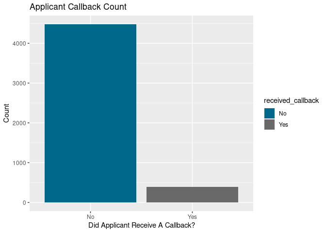

Activity 6 - Logistic Regression
================

``` r
resume <- read_csv("https://www.openintro.org/data/csv/resume.csv")
```

    ## Rows: 4870 Columns: 30
    ## ── Column specification ────────────────────────────────────────────────────────
    ## Delimiter: ","
    ## chr (10): job_city, job_industry, job_type, job_ownership, job_req_min_exper...
    ## dbl (20): job_ad_id, job_fed_contractor, job_equal_opp_employer, job_req_any...
    ## 
    ## ℹ Use `spec()` to retrieve the full column specification for this data.
    ## ℹ Specify the column types or set `show_col_types = FALSE` to quiet this message.

1.  Is this an observational study or an experiment? Explain.

**Answer:** This is an observational study. Yes, they used random
assignment but there is no control condition (real resumes belonging to
real people). Random assignment != experiment.

2.  The variable of interest is received\_callback. What type of
    variable is this? What do the values represent?

**Answer:** `received_callback` is a categorical variable with two
levels: yes and no.

3.  For received\_callback, create an appropriate data visualization
    using {ggplot2}. Be sure to provide more descriptive labels (both
    axes labels and value labels - there are many ways to do this) as
    well as an appropriate title.

``` r
resume$received_callback <- as.factor(resume$received_callback)

# new = old
resume <- resume %>% 
  mutate(received_callback = fct_recode(received_callback,
                                        "No" = "0",
                                        "Yes" = "1"))
```

``` r
cp <- c("deepskyblue4", "dimgrey")
```

``` r
ggplot(data = resume) +
  geom_bar(aes(x = received_callback, fill = received_callback)) +
  scale_fill_manual(values = cp) +
  labs(title = "Applicant Callback Count", x = "Did Applicant Receive A Callback?", y = "Count")
```

<!-- -->

4.  Below, I provide you with a numerical summary table that should
    reiterate (i.e., provides numerical values) your plot in (3). Write
    the code to produce this table.

``` r
resume %>% 
  group_by(received_callback) %>% 
  summarise(n = n()) %>% 
  mutate(percent = round(n/sum(n)*100, 2))
```

    ## # A tibble: 2 × 3
    ##   received_callback     n percent
    ##   <fct>             <int>   <dbl>
    ## 1 No                 4478   92.0 
    ## 2 Yes                 392    8.05

5.  Using the output from (4) and (5), what do you notice?

**Answer:** Looking at the table we can see that over 90% of applicants
did not receive a callback.

6.  What is the probability that a randomly selected résumé/person will
    be called back?

$Pr(\texttt{received_callback} = Yes) = 0.08$

7.  What are the odds that a randomly selected résumé/person will be
    called back?

$\frac{Pr(Y_i = Yes)}{Pr(Y_i = No)} = \frac{p_i}{1-p_i} = \frac{0.08}{1 - 0.08} = 0.08696$

The odds are 0.08696 to 1.

``` r
resume_mod <- logistic_reg() %>%
  set_engine("glm") %>%
  fit(received_callback ~ race, data = resume, family = "binomial")

tidy(resume_mod) %>% 
  knitr::kable(digits = 3)
```

| term        | estimate | std.error | statistic | p.value |
|:------------|---------:|----------:|----------:|--------:|
| (Intercept) |   -2.675 |     0.083 |   -32.417 |       0 |
| racewhite   |    0.438 |     0.107 |     4.083 |       0 |

8.  Write the estimated regression equation. Round to 3 digits
